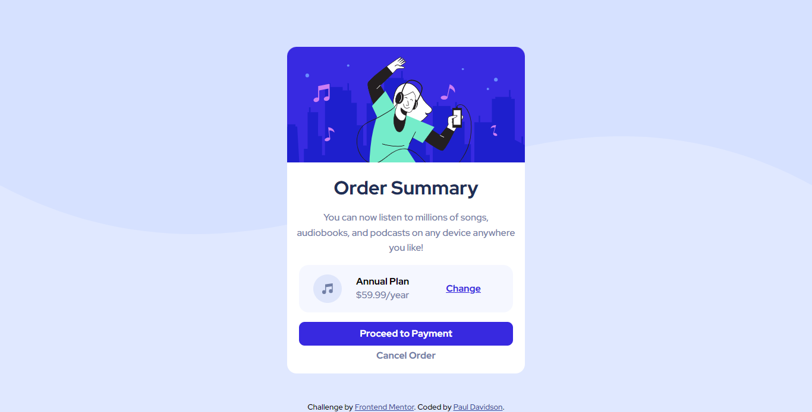

# Frontend Mentor - Order summary card solution

This is a solution to the [Order summary card challenge on Frontend Mentor](https://www.frontendmentor.io/challenges/order-summary-component-QlPmajDUj). Frontend Mentor challenges help you improve your coding skills by building realistic projects.

## Table of contents

- [Overview](#overview)
  - [The challenge](#the-challenge)
  - [Screenshot](#screenshot)
  - [Links](#links)
- [My process](#my-process)
  - [Built with](#built-with)
  - [Continued development](#continued-development)
- [Author](#author)
- [Acknowledgments](#acknowledgments)

**Note: Delete this note and update the table of contents based on what sections you keep.**

## Overview

### The challenge

Users should be able to:

- See hover states for interactive elements

### Screenshot

Desktop

Mobile

### Links

- Solution URL: [https://github.com/Conscious-Mind/fm-ch2-order-summary](https://github.com/Conscious-Mind/fm-ch2-order-summary)
- Live Site URL: [https://davidson-order-summary.netlify.app/](https://davidson-order-summary.netlify.app/)

## My process

### Built with

- Semantic HTML5 markup
- CSS custom properties
- Flexbox
- Mobile-first workflow

### Continued development

- need to rectify lot of resposive issues
- mobile view not satisfactory

## Author

- Github - [@Conscious-Mind](https://github.com/Conscious-Mind)
- Frontend Mentor - [@Conscious-Mind](https://www.frontendmentor.io/profile/Conscious-Mind)
- Linkedin - [@PaulDavidson](https://www.linkedin.com/in/paul-david-son/)

## Acknowledgments

Thanks to the Frontend Mentor for giving me this challenge.
